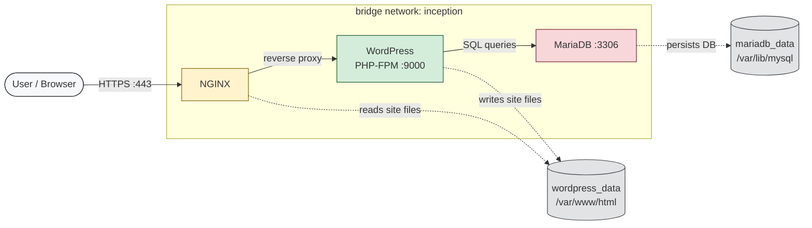

<div align="center">

# ft_inception

**System Administration — Docker Compose** · _42 Network Project_

A small, self-hosted **WordPress** website served over **TLSv1.2/1.3** and powered by **MariaDB**, **PHP-FPM** and **NGINX** — each running in its own Docker container, orchestrated with **Docker Compose**, and built **from scratch** on plain `debian:bookworm` images.

</div>

---

## Table of Contents

- [Overview](#overview)
- [Architecture](#architecture)
- [Project structure](#project-structure)
- [How it works](#how-it-works)
- [Getting started](#getting-started)
  - [Prerequisites](#prerequisites)
  - [1. Configure the environment](#1-configure-the-environment)
  - [2. Build & start](#2-build--start)
  - [3. Visit the site](#3-visit-the-site)
- [Makefile targets](#makefile-targets)
- [Security & going public](#security--going-public)
- [What was NOT used](#what-was-not-used)
- [Resources](#resources)

---

## Overview

`ft_inception` (subject name: **Inception**) is the 42 school's introduction to **Docker** and **orchestration**. The goal is to set up a multi-container infrastructure where every service is **hand-built** — no ready-made images for the _application_ itself.

This repository implements the **mandatory part**:

| Service       | Role                                        | Listens on             |
| ------------- | ------------------------------------------- | ---------------------- |
| **NGINX**     | Reverse proxy / web server, TLS termination | `443/tcp` (HTTPS only) |
| **WordPress** | PHP-FPM + WordPress (via **WP-CLI**)        | `9000` (internal)      |
| **MariaDB**   | Relational database                         | `3306` (internal)      |

Only **NGINX** exposes a port to the outside world. The two other services communicate over an **internal Docker network** and are unreachable from the host.

---

## Architecture



**Key design points (as required by the subject):**

- A dedicated **bridge network** (`inception`) lets the containers talk to each other by **service name** (`nginx`, `wordpress`, `mariadb`).
- Two **named volumes** persist the data on the host:
  - `wordpress_data` → `/var/www/html` — **shared** between `nginx` and `wordpress`.
  - `mariadb_data` → `/var/lib/mysql`.
- Every service uses `restart: always`.
- No pre-configured images (`docker pull nginx`, `wordpress`, `mariadb`, etc.) were used for the services — each image is built from `debian:bookworm`.
- No `:latest` tag and no `network: host` / `--link`.
- **TLS** (self-signed) is set up for NGINX, which is the only entry point.

---

## Project structure

```text
inception/
├── Makefile                 # Build & lifecycle commands
├── README.md
└── srcs/
    ├── .env.example         # Environment template (copy to .env)
    ├── docker-compose.yml   # Orchestration of the 3 services
    └── requirements/        # One folder per service
        ├── mariadb/
        │   ├── Dockerfile   # debian:bookworm + mariadb-server
        │   └── tools/
        │       └── script.sh        # DB init (database, user, grants)
        ├── nginx/
        │   ├── Dockerfile   # debian:bookworm + nginx + openssl
        │   └── conf/
        │       └── nginx.conf        # TLS server on 443, proxies PHP
        └── wordpress/
            ├── Dockerfile   # debian:bookworm + php-fpm + php-mysql + wp-cli
            └── tools/
                └── script.sh          # Downloads & installs WordPress
```

---

## How it works

| Component     | Details                                                                                                                                                                                                                              |
| ------------- | ------------------------------------------------------------------------------------------------------------------------------------------------------------------------------------------------------------------------------------ |
| **NGINX**     | Serves `index.php` from `/var/www/html`, listens **only** on `443` with a **self-signed certificate** generated at build time. Requests for `*.php` are forwarded to `wordpress:9000` via FastCGI.                                   |
| **WordPress** | On first start, the entrypoint downloads **WP-CLI**, fetches the WordPress core, waits for MariaDB to be reachable, generates `wp-config.php` from the environment variables and runs the installation. Then hands off to `php-fpm`. |
| **MariaDB**   | On first start, boots the server, creates the database (`DB_NAME`), the user (`DB_USER`) and grants all privileges, then relaunches `mysqld_safe` bound to all interfaces so the other containers can connect.                       |

> **Idempotency:** both entrypoint scripts only act when data is missing, so restarting a container never wipes or re-seeds existing data.

---

## Getting started

### Prerequisites

- A Linux machine (the 42 evaluation environment — typically a Debian/Ubuntu VM)
- **Docker** ≥ 20.10 and the **Docker Compose plugin** (`docker compose` v2)
- `make`

Check your setup with:

```bash
docker --version
docker compose version
```

### 1. Configure the environment

```bash
cd inception/srcs
cp .env.example .env
# then edit .env to match YOUR login, domain and passwords
```

> The **domain** in `.env`, the `server_name` in `nginx/conf/nginx.conf`, and the **CN** of the TLS certificate in the NGINX `Dockerfile` all reference `mboughra.42.fr`. Update all three to your own `<login>.42.fr`.

### 2. Build & start

From the `inception/` folder:

```bash
make          # builds the 3 images and starts the stack
```

Or step by step:

```bash
make build
make up
```

### 3. Visit the site

Open your browser at:

```text
https://<your-login>.42.fr
```

You will get a self-signed certificate warning — accept it and you'll land on your **WordPress** site.

**Log in** to the admin dashboard at:

```text
https://<your-login>.42.fr/wp-admin
```

using the `WP_ADMIN_USER` / `WP_ADMIN_PASSWORD` values from your `.env`.

---

## Makefile targets

Run `make` targets from the `inception/` directory.

| Target   | Description                                                      |
| -------- | ---------------------------------------------------------------- |
| `all`    | _(default)_ Build images and start the stack in detached mode    |
| `build`  | Build the Docker images                                          |
| `up`     | Create host data folders and start containers                    |
| `down`   | Stop and remove containers (data kept)                           |
| `stop`   | Stop containers (kept)                                           |
| `start`  | Restart stopped containers                                       |
| `clean`  | `down` + remove images & named volumes                           |
| `fclean` | `clean` + delete persisted host data + `docker system prune -af` |
| `re`     | `fclean` then `all` (full rebuild)                               |
| `logs`   | Tail logs from every service                                     |
| `ps`     | List running containers                                          |

> **Override data paths without editing:** the host folders are defined at the top of the `Makefile`. You can override them on the command line (e.g. `make DATA_PATH_DB=$HOME/data/mariadb ...`), but remember the **same paths** must match the `device:` entries in `srcs/docker-compose.yml`.

---

## Security & going public

This project was developed for the **42 vogsphere evaluation** — it uses throwaway local credentials on purpose.

Before making your GitHub repository **public**, please do the following:

1. **Secrets** — real credentials must never be committed. This repo already:
   - adds a **`.gitignore`** that excludes `inception/srcs/.env` (and any `.env`),
   - provides a sanitized **`.env.example`** template instead.
2. **If you previously pushed a `.env`** (with passwords / emails), those secrets remain in the **git history** even after deletion. To scrub them you must rewrite history — e.g. with [`git-filter-repo`](https://github.com/newren/git-filter-repo):

   ```bash
   pipx install git-filter-repo        # or: brew install git-filter-repo
   cd <repo>
   git filter-repo --invert-paths --path inception/srcs/.env --force
   git remote add origin git@github.com:<you>/<repo>.git
   git push origin --force --all
   ```

   > Rewriting history changes commit hashes — **do this before** collaborators clone or before it's public.

3. **Hardcoded personal data** — replace any occurrence of your intra login / email in `nginx.conf`, the NGINX `Dockerfile`, `.env.example` and this README with a placeholder such as `<login>`.

Once clean, flip your repository to public:

- **GitHub web UI:** _Settings → General → Danger Zone → Change visibility → Make public_.
- **`gh` CLI:** `gh repo edit <owner>/<repo> --visibility public`

---

## What was NOT used

To stay true to the subject's mandatory rules:

- No `latest` image tags
- No pre-configured / ready-made service images (only `debian:bookworm` as base)
- No `network: host`, no `--link`, no `links:`
- No `docker-compose.yml` in `~/.docker` or other system folders
- No passwords in Dockerfiles or the compose file (everything comes from `.env`)
- NGINX is the only container exposed to the host (`443`)

---

## Resources

- [42 subject: Inception](https://cdn.intra.42.fr/pdf/pdf/85535/en.subject.pdf)
- [Docker docs](https://docs.docker.com/)
- [Docker Compose spec](https://docs.docker.com/compose/compose-file/)
- [WordPress with Docker](https://wordpress.org/documentation/article/install-wordpress-with-docker/)
- [WP-CLI](https://wp-cli.org/)
- [MariaDB knowledge base](https://mariadb.com/kb/en/)

---

<div align="center">

Made with 🐳 for the **42 Network** — _System Administration / Docker module_.

</div>
